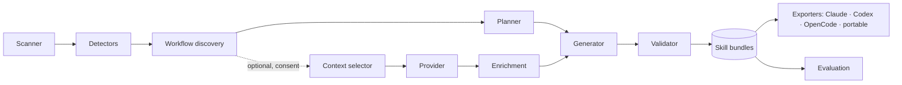

# SkillForge

**Turn your codebase and developer workflows into reusable AI agent skills.**

SkillForge is a Python CLI that reads a repository, works out how it is built,
run, tested, and operated — then generates portable
[Agent Skills](https://agentskills.io/specification) (`SKILL.md` + `references/` +
`scripts/`) for coding agents such as Claude Code, OpenAI Codex, and OpenCode.

It runs **locally and deterministically by default**. No API key is required for
analysis, planning, generation, validation, or export. An LLM is optional and
consent-gated, and it can never add commands that are not backed by repository
evidence.

```
Repository → Discovery → Static analysis → Workflows → Skill plan
           → Generation → Validation → Agent-specific export
```

## The problem

Every agent session starts by re-discovering the same operational knowledge:
which command starts the dev server, which services must be running first, which
migration command is safe, what must not be run. That knowledge is implicit in
manifests, Makefiles, compose files, and CI — scattered and easy to get wrong.

Skills fix this, but hand-writing them does not scale and LLM-written skills
hallucinate commands. SkillForge generates them from evidence: every command in a
generated skill points back to the file it came from.

## Demo

```console
$ pip install -e .
$ skillforge analyze examples/fastapi-demo

Analyzing …/examples/fastapi-demo

┌─────────────────────────────── Repository ────────────────────────────────┐
│ fastapi-demo                                                              │
│ 19 files · 364 lines · 7 KiB · 18 read                                     │
└───────────────────────────────────────────────────────────────────────────┘
 Languages    python, yaml, toml, markdown, make
 Frameworks   FastAPI >=0.115
 Databases    PostgreSQL, Redis
 CI/CD        GitHub Actions
 Packages     uv
 Containers   Docker, Docker Compose

19 files · 364 lines · 25 evidenced commands · 7 workflows

Detected workflows
 Workflow             Commands                            Confidence
 Setup                make install · uv sync · …               0.98
 Development server   docker compose up · make run · …         0.98
 Testing              make test · pytest · uv run pytest       0.95
 Lint and type check  make lint · ruff check . · mypy .         0.98
 Database migration   alembic upgrade head · make migrate     0.95

Recommended skills
 project-runner        The application can be started with `make run` (Makefile:L6).
 test-runner           The test suite runs with `make test` (Makefile:L9) using pytest.
 project-debugger      … dependency services (cache, db) and an HTTP API surface.
 migration-guardian    Migration tooling detected: Alembic.
 database-debugger     Database dependencies detected: PostgreSQL, Redis.
 api-contract-checker  HTTP API surface detected (FastAPI).
 code-reviewer         Static analysis tooling detected: mypy ., ruff check .

$ skillforge generate examples/fastapi-demo
Generated 8 skill(s) under examples/fastapi-demo/.skills/

$ skillforge validate examples/fastapi-demo
All 8 skill(s) passed validation.

$ skillforge export examples/fastapi-demo --to all
Claude Code (.claude/skills) · Codex (.agents/skills) · OpenCode (.opencode/skills) · portable (skills/)
```

A generated skill looks like this (abridged from `examples/fastapi-demo`):

```markdown
---
name: project-runner
description: Start and verify the fastapi-demo application locally. Use when the user
  asks to run the app, start a development server, boot the service, or check that
  local setup works. Commands come from repository evidence …
compatibility: Requires Python >=3.12, Docker
metadata:
  generator: skillforge
  generator-version: 0.1.0
  source-repository: fastapi-demo
  certainty: inference
---

# Project runner

Python / Yaml / Toml · FastAPI · 19 files, 364 lines.

## When to use this skill
- The user wants to start, restart, or smoke-test the application locally.

## Quick start
```bash
make run
```
The command comes from `Makefile:L6` (Makefile).

## Dependency services
| Service | Kind | Image | Ports |
| --- | --- | --- | --- |
| cache | cache | `redis:7-alpine` | 6379:6379 |
| db | database | `postgres:16-alpine` | 5432:5432 |

## Steps
1. `make install` — from `Makefile:L3` — Risk: SAFE
2. `uv sync` — from `uv.lock:tool.uv` — Risk: REVIEW_REQUIRED
…
```

Every skill also ships `references/evidence.md` (provenance for each command),
`references/commands.md`, `references/architecture.md`, and deterministic
read-only scripts such as `scripts/preflight.py` and `scripts/run_steps.py`.

## Installation

```bash
git clone https://github.com/skillforge/skillforge
cd skillforge
python -m venv .venv && . .venv/bin/activate   # Windows: .venv\Scripts\activate
pip install -e .
skillforge --help
sf --help          # short alias
```

Optional LLM support:

```bash
pip install -e ".[llm]"
```

## Quick start in any repository

```bash
cd /path/to/your/project
skillforge init                # creates skillforge.toml + .gitignore entry
skillforge analyze             # stack, workflows, recommended skills
skillforge generate            # writes .skills/<name>/
skillforge validate            # 11 check families, exits non-zero on errors
skillforge export --to claude  # or codex, opencode, portable, all
skillforge doctor              # environment and agent availability
```

Useful flags:

```bash
skillforge analyze --json                  # machine-readable output
skillforge generate --force                # overwrite existing skills
skillforge generate --only-safe            # restrict to SAFE commands
skillforge generate --provider mock        # exercise the LLM path offline
skillforge generate --provider openai --allow-external-llm   # explicit consent
skillforge validate --strict               # treat missing manifests as warnings
skillforge eval                            # run the benchmark scenarios
```

## What gets detected

| Area | Detected from |
| --- | --- |
| Python | `pyproject.toml` (PEP 621, Poetry, dependency-groups), `requirements*.txt`, lockfiles, FastAPI/Django/Flask, pytest, ruff, mypy, Alembic |
| Node / TypeScript | `package.json` scripts and dependencies, lockfile → package manager, Next.js/Nuxt/Remix/Astro, Express/Fastify/NestJS, Jest/Vitest/Playwright, Prisma, npm workspaces |
| Go | `go.mod`, Gin/Echo/Fiber/chi, GORM/Ent/sqlx, `go test`/`go build`/`go vet` |
| .NET | `.sln`, `.csproj`/`.vbproj`/`.fsproj`, ASP.NET Core, EF Core providers, xUnit/NUnit/MSTest, `dotnet ef` |
| Flutter / Dart | `pubspec.yaml`, Riverpod/Bloc, dio, sqflite/drift/Hive, platform build targets |
| Java / Kotlin | `pom.xml`, `build.gradle(.kts)`, Spring Boot, JUnit, Flyway/Liquibase |
| Infrastructure | Dockerfiles, Compose services/ports/image, Makefile targets, Taskfile, Procfile, Kubernetes, Terraform |
| CI/CD | GitHub Actions workflows (jobs, steps, services, `uses`), GitLab CI |
| Database | Migration tools and directories, SQL migrations, connection-string schemes in env templates |
| Documentation | README/docs structure, command extraction from shell code blocks |

Ignored by default: `.git`, dependency and build output directories, binaries,
generated files, lockfile *contents*, and every secret-looking file
(`.env`, `*.pem`, keys, credentials). `.env.example` is read for variable
**names** only.

## Generated skills

Nine skill types, each recommended only when the repository justifies it:

`project-runner` · `project-builder` · `test-runner` · `project-debugger` ·
`database-debugger` · `migration-guardian` · `api-contract-checker` ·
`code-reviewer` · `release-verifier`

Recommendations carry a reason, evidence, confidence, dependencies, and risks —
for example: *"Migration tooling detected: Alembic (`alembic.ini`)."*

## Security model

- **Discovery never executes repository content.** Commands are parsed, classified,
  and quoted as evidence; never run.
- **Execution is not implemented in v0.1.** `security.allow_command_execution = true`
  is rejected at configuration load. Generated scripts refuse review-level steps
  without `--confirm`, never contain destructive commands, and never use a shell.
- **Destructive commands are excluded** from skills by a static risk classifier
  (`SAFE` / `REVIEW_REQUIRED` / `DANGEROUS`), and the validator errors if one
  appears anyway.
- **Secrets never travel:** secret files are skipped before reading, evidence
  snippets are redacted at model construction, logs pass a redaction filter, and
  the validator scans generated output.
- **Prompt injection is treated as data:** suspicious instructions in docs become
  repository risks, and LLM prompts wrap repository content in untrusted-data
  delimiters.
- **External transmission requires explicit consent** (`--allow-external-llm` or
  `security.allow_external_transmission = true`); localhost endpoints are exempt.
- Path traversal, symlink escapes, and absolute paths are rejected by
  `safe_join` and by validator checks.

Full details: [docs/security.md](docs/security.md).

## Supported agents

| Agent | Project location | Global location |
| --- | --- | --- |
| Claude Code | `.claude/skills/<name>/SKILL.md` | `~/.claude/skills` |
| OpenAI Codex | `.agents/skills/<name>/SKILL.md` | `~/.agents/skills` |
| OpenCode | `.opencode/skills/<name>/SKILL.md` | `~/.config/opencode/skills` |
| Portable / any conforming agent | `skills/<name>/SKILL.md` | — |

The internal representation is agent-neutral; exporters only decide *where*
skills live. Formats were verified against the published documentation on
2026-10-03 (see [docs/skill-format.md](docs/skill-format.md)); OpenCode and Codex
also read Claude Code's directory, which the exporters document.

## Evaluation

```console
$ skillforge eval
 Evaluation scenarios
 dotnet-ef-migration        9/9   PASS    8 skills
 fastapi-health-endpoint   13/13  PASS    8 skills
 go-add-handler             9/9   PASS    6 skills
 hostile-repository-safety  7/7   PASS    2 skills
 …

 Agent comparison (without skill vs with skill)
 task_success      NOT MEASURED   NOT MEASURED
 tokens_consumed   NOT MEASURED   NOT MEASURED
```

Deterministic metrics (skills generated, commands documented, % with provenance,
validation errors, embedded dangerous commands, SKILL.md tokens, latencies) are
measured by running the real pipeline. Agent metrics require a real agent run and
are reported as `NOT MEASURED` unless you supply recordings — SkillForge never
fabricates benchmark numbers. See [benchmarks/README.md](benchmarks/README.md).

## Architecture



More detail: [docs/architecture.md](docs/architecture.md).

## Repository layout

```
src/skillforge/
├── cli/          # Typer commands + Rich rendering
├── models/       # pydantic domain models (pure data)
├── analyzer/     # scanner, ignore rules, detectors/
├── discovery/    # command parsing + workflow synthesis
├── context/      # token-budgeted context selection
├── planner/      # rule-based skill recommendation
├── generator/    # blueprints, Jinja templates, scripts, enrichment
├── skills/       # bundle model + safe on-disk store
├── validator/    # 11 check families
├── security/     # secrets, command risk, path safety, injection, redaction
├── providers/    # LLMProvider protocol + adapters
├── exporters/    # agent adapters
└── evaluation/   # scenarios, checks, honest metrics
```

## Development

```bash
pip install -e ".[dev]"
ruff check src tests
ruff format --check src tests
mypy
pytest -q                       # 320+ tests, no network required
python -m build                 # package build
```

Test layout:

- `tests/unit/` — scanner/ignore, discovery, planner, generator, validator,
  security, providers, context, exporters, evaluation, CLI
- `tests/integration/` — fixture analysis for FastAPI, Next.js, Go, .NET,
  Flutter, mixed monorepo, and a hostile repository; full CLI workflow
- `tests/fixtures/` — real (small) repositories, also used by `skillforge eval`
- `benchmarks/scenarios/` — evaluation scenarios

No test requires an API key. Provider tests use a fake in-process provider.

## Limitations (v0.1, stated honestly)

- Execution is not implemented: SkillForge will not run your commands, and
  evaluation does not run agents.
- Go, Java, .NET, and Flutter detectors read the root manifest; multi-module
  layouts are only partially analysed (Python and Node handle per-package
  manifests).
- Command discovery is regex/JSON/TOML/YAML based; no tree-sitter AST analysis yet.
- No incremental analysis, caching, or file watching.
- `skillforge learn` (observing a real workflow and generalizing it) is designed
  for but not implemented.
- The portable frontmatter avoids `allowed-tools` on purpose.

## Roadmap

- **v0.2** — tree-sitter symbol analysis, multi-module Go/Java support, richer
  workflow graphs.
- **v0.3** — `skillforge learn`: capture a successful procedure, strip project
  specifics and secrets, generalize it, and evaluate the result.
- **v0.4** — workspaces and multi-repository dependency analysis.
- **v0.5** — real-agent evaluation harness with sandboxed execution and recorded
  transcripts; MCP server so agents can query SkillForge directly.
- **Later** — skill registry and sharing, interactive TUI, automatic skill
  improvement from evaluation feedback.

## Contributing

See [CONTRIBUTING.md](CONTRIBUTING.md). Security reports: [SECURITY.md](SECURITY.md).
Release process: [RELEASING.md](RELEASING.md).
Adding a target agent: [docs/adding-an-exporter.md](docs/adding-an-exporter.md).
Adding a provider: [docs/adding-a-provider.md](docs/adding-a-provider.md).

## License

MIT — see [LICENSE](LICENSE).
