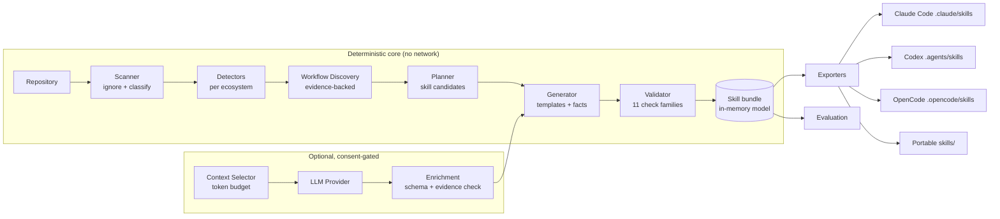

# SkillForge — Implementation Plan

> Status: initial plan (v0.1). This document is the contract for what the first
> release does and does not do. It is updated when scope changes.

## 1. Problem statement

Coding agents (Claude Code, OpenAI Codex, OpenCode, …) are only as good as the
context they are given. Every repository contains implicit operational knowledge:
how to run it, how to test it, which services must be up, which migration command
is safe, which environment variables matter. Today that knowledge is re-discovered
by every developer and every agent, usually by trial and error, and often by
running destructive commands in the wrong order.

SkillForge converts that knowledge into **Agent Skills** — the portable
`SKILL.md` format defined by the [Agent Skills specification](https://agentskills.io/specification).
It does this deterministically from repository evidence first, with optional
(consented) LLM assistance for phrasing and synthesis — never as a requirement.

## 2. Non-goals

- SkillForge is **not** a chatbot and does not include an agent loop.
- SkillForge never executes repository commands during analysis.
- SkillForge does not send repository contents to an external LLM by default.
  Transmission requires explicit, per-invocation consent.
- SkillForge does not invent commands that are not evidenced in the repository.
- SkillForge does not provide an agent execution sandbox in v0.1.

## 3. MVP boundary (v0.1)

In scope:

1. Deterministic repository scanning with ignore rules and secret exclusion.
2. Stack detection for Python, Node/TypeScript, Go, .NET, Flutter, Java, plus
   infrastructure (Docker, Compose, Make, Task), CI (GitHub Actions, GitLab CI),
   databases/migrations, API specs, and docs.
3. Evidence-backed command and workflow discovery.
4. Rule-based skill planning for the nine initial skill types.
5. Deterministic skill generation (no LLM) producing `SKILL.md`, `references/`,
   `scripts/`, and a `.skillforge.json` manifest with provenance.
6. Validation with 11 check families (structure, frontmatter, references,
   scripts, secrets, paths, sizes, duplicates, command evidence, risk, links,
   manifest integrity).
7. Security layer: secret detection + redaction, command risk classifier,
   path/symlink guards, prompt-injection heuristics, log redaction.
8. Exporters for Claude Code, Codex, OpenCode, and the portable Agent Skills
   layout.
9. Optional LLM providers (OpenAI-compatible, Anthropic) behind a consent gate,
   with schema validation and evidence cross-checking of model output.
10. Evaluation harness with deterministic checks and honest `NOT MEASURED`
    reporting for anything that would require running a real agent.
11. CLI: `init`, `analyze`, `generate`, `list`, `validate`, `doctor`, `eval`,
    `export`, `clean`, with `sf` alias, `--json`, `--verbose`, `--debug`.

Out of scope for v0.1 (architected, not implemented — see roadmap):

- `skillforge learn` (observing real workflows).
- Tree-sitter AST analysis (interfaces reserved; regex/JSON/TOML parsing only).
- Multi-repository workspaces and dependency analysis across repos.
- Real agent execution for evaluation (recorded transcript replay only).
- MCP integration, TUI, registry, remote sharing.

## 4. Architecture



Dependency direction: `cli → services → models`. `security`, `utils`, and
`models` have no upward dependencies. Providers depend on models only and are
injected into the generator. Exporters depend on the skill bundle model, never on
the generator.

### Package layout

```
src/skillforge/
├── cli/            # Typer app + per-command modules + Rich rendering
├── models/         # Pydantic domain models (no I/O)
├── analyzer/       # scanner, ignore, languages, detectors/
├── discovery/      # command extraction, workflow synthesis
├── context/        # file classification, token-budgeted selection
├── planner/        # rule-based skill recommendation
├── generator/      # blueprint → bundle, Jinja templates, enrichment merge
├── skills/         # portable skill bundle model, frontmatter, disk store
├── validator/      # checks/ package, orchestration
├── security/       # secrets, command risk, paths, injection, redaction
├── evaluation/     # scenarios, checks, runner, report
├── providers/      # LLMProvider protocol, registries, adapters
├── exporters/      # BaseExporter + agent adapters
└── utils/          # fs, text, tokens, git, subprocess probe
```

## 5. Internal models (Pydantic v2)

All models are defined in `src/skillforge/models/` and are pure data (no I/O).

| Model | Purpose |
| --- | --- |
| `Evidence` | One observation with `kind ∈ {fact, inference, unknown}`, source path, locator, redacted snippet, weight |
| `DetectedTechnology` | Language/framework/tool with version, certainty, confidence, evidence |
| `Dependency` | Ecosystem, name, version spec, scope, certainty |
| `Command` | Normalized command, source kind, cwd, purpose, risk level, evidence |
| `Workflow` | Named group of commands with category, prerequisites, evidence |
| `Service` / `Database` / `API` | Discovered infrastructure and interfaces |
| `Risk` | Repository risk with severity and evidence |
| `RepositoryProfile` | Aggregated analysis result (deterministic, serializable) |
| `SkillCandidate` | Planned skill with reason, evidence, confidence, deps, risks, priority |
| `SkillMetadata` / `SkillBundle` | Portable skill representation (frontmatter + files) |
| `GeneratedSkill` | Bundle + provenance + warnings + generation mode |
| `ValidationFinding` / `ValidationResult` | Severity-coded findings |
| `MetricValue` / `ScenarioResult` / `EvaluationReport` | Evaluation output; every metric is `measured: bool` |

Every factual claim carries `certainty` and at least one `Evidence`. Inference is
never rendered as fact in generated skills.

## 6. Evidence model and provenance

- `Certainty.FACT` — directly observed in a file (e.g. `package.json` declares
  `"next": "16.0.0"`).
- `Certainty.INFERENCE` — derived by a rule (e.g. "app likely starts with
  `next dev`" given a `dev` script).
- `Certainty.UNKNOWN` — explicitly recorded gap (e.g. "whether Redis is required
  in development").

Generated skills render facts with their source (`package.json:scripts.dev`) and
list inference/unknown items in explicitly labelled sections. Full provenance is
written to `references/evidence.md` and `.skillforge.json`.

## 7. Security boundaries

| Stage | Rules |
| --- | --- |
| DISCOVERY | Read-only. Never executes repository content. Secret files are excluded before reading; snippets are redacted. Symlinks are not followed. Files above `max_file_size` are summarized, not read. |
| VALIDATION | Static. Command risk classification is token-based, never shell-evaluated. Secret scanning on generated output. Path traversal and absolute local paths rejected. |
| EXECUTION | Not implemented in v0.1. `[security] allow_command_execution = false` is the only supported value; generated scripts that *could* run commands refuse to run without `--confirm` and never contain DANGEROUS commands. |

Additional rules:

- Repository text is **data**, never instructions. README/CI content is parsed
  for patterns, quoted into evidence, and never fed to a prompt as instructions;
  when sent to a provider it is wrapped in untrusted-content delimiters.
- Prompt-injection heuristics flag suspicious instructions in docs and surface
  them as `Risk` entries.
- External transmission requires `--allow-external-llm` (or config) **and** an
  explicit provider; default provider is `none`.
- Logs pass through a redaction filter; API keys are only read from env vars and
  never printed, stored, or exported.

## 8. Acceptance tests (MVP)

1. `skillforge analyze examples/fastapi-demo` detects Python/FastAPI/Docker/CI,
   ≥4 workflows with evidence, and ≥3 skill candidates.
2. `skillforge generate examples/fastapi-demo` writes ≥1 skill (including
   `project-runner`) with provenance in `references/evidence.md`.
3. `skillforge validate examples/fastapi-demo` exits 0 with no errors.
4. Fixtures for FastAPI, Next.js, Go, .NET, Flutter, and a mixed monorepo each
   detect the expected stack and at least one evidenced workflow.
5. A "hostile" fixture (injection text, fake secrets, dangerous commands, path
   traversal links) produces warnings/errors, never executes anything, and never
   leaks secrets into output.
6. No API key is required for 1–5, and tests pass offline.
7. Exporters produce spec-valid layouts for all four targets.
8. `skillforge eval` reports deterministic metrics as measured and agent
   metrics as `NOT MEASURED`.
9. CI: ruff, mypy, pytest (3.12/3.13, Linux + Windows), package build.
10. README quick start reproduces the demo verbatim.

## 9. Phases

| Phase | Deliverable | Gate |
| --- | --- | --- |
| 1 | Structure, config, models, logging, utils | unit tests green |
| 2 | Scanner, ignore, detectors, discovery | fixture detection tests green |
| 3 | Planner | rule tests green |
| 4 | Generator + templates + bundle | generation tests green |
| 5 | Validator + security | hostile fixture tests green |
| 6 | Exporters | export layout tests green |
| 7 | Providers + context selection | provider tests with fake transport |
| 8 | Evaluation | scenario tests + honest report |
| 9 | Docs, README, CI, examples | CI-equivalent local run |

## 10. Key risks and mitigations

| Risk | Mitigation |
| --- | --- |
| False-positive framework detection | require manifest evidence; version from manifest; `UNKNOWN` when unclear |
| Command hallucination | commands only from parsers; LLM proposals must match discovered commands or are dropped with a warning |
| Windows portability | all path logic via `pathlib`, forward-slash relative paths in artifacts, no shell execution, CI job on Windows |
| Secret leakage into artifacts | exclude-before-read, redact snippets, output secret scan in validator, redaction log filter |
| Repository size | max file size, ignore rules, per-category budgets, no full-repo copying |
| Agent format drift | exporters centralized, spec conformance validated by tests; formats documented with "verified against docs on 2026-10-03" |

## 11. Outcome (v0.1.0)

Delivered as planned, with these deltas recorded honestly:

| Phase | Status | Notes |
| --- | --- | --- |
| 1 Foundation | done | models, config (TOML + env + CLI precedence), logging/tracing, utils |
| 2 Deterministic analyzer | done | scanner, 11 detectors, command + workflow discovery, 7 fixture repositories |
| 3 Planner | done | 9 rule-based skill types with evidence, confidence, dependencies, risks |
| 4 Generator | done | Jinja templates, references, 6 deterministic script templates, provenance |
| 5 Validation + security | done | 11 check families; secret/risk/path/injection guards; consent gate |
| 6 Exporters | done | Claude Code, Codex, OpenCode, portable; layouts verified against docs |
| 7 LLM integration | done | provider protocol, mock/OpenAI-compatible/Anthropic adapters, context selector, evidence-checked enrichment |
| 8 Evaluation | done | 7 scenarios, deterministic metrics, `NOT MEASURED` agent metrics, recorded-run support |
| 9 Docs / polish | done | README, architecture, security, skill format, exporter/provider guides, CI |

Known gaps carried into the roadmap: command execution and sandboxed agent
evaluation (`skillforge learn`, real benchmarks), tree-sitter analysis,
multi-module Go/Java detection, incremental caching. Each is documented in the
README's limitation list and is *not* claimed as working.

Validation counts differ slightly from the original plan: the proposal listed
"12 check families", the implementation has 11 families that cover the same 13
concerns (structure, metadata, body, size, duplicates, references, script syntax,
paths, secrets, command safety, evidence, manifest, assumptions).

