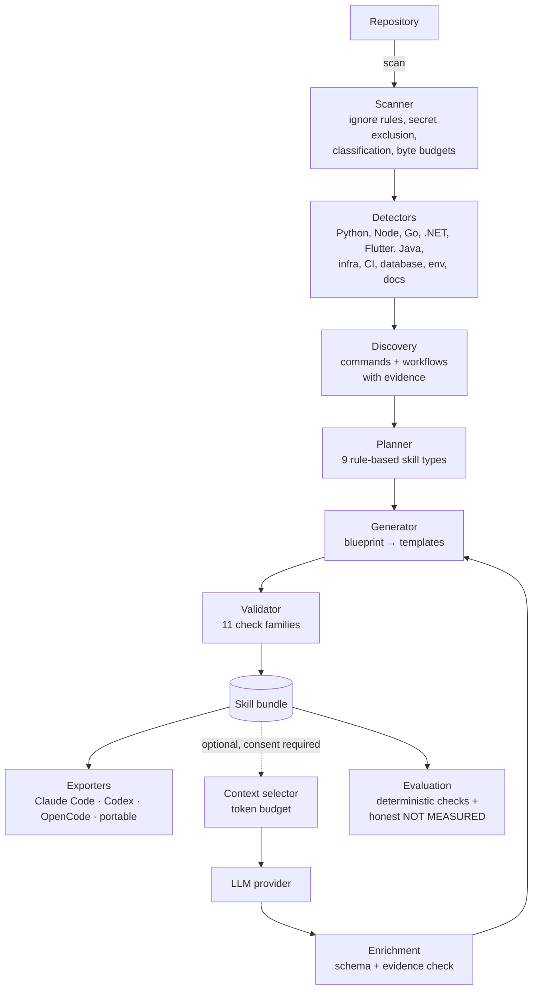

# Architecture

## Pipeline



Every arrow is a Python package with a narrow interface. The deterministic
column (left) is the product; the optional column (right) is an enhancement that
can be removed without breaking anything.

## Layers and dependency direction

```
cli  →  services (analyzer, planner, generator, validator, evaluation, doctor)
             ↓
     models (pydantic, pure data)      security (pure functions)
             ↓                               ↓
                        utils (no domain knowledge)
```

- `models` never imports services, never touches the filesystem.
- `security` depends only on `models` and `utils`. It has no I/O.
- `analyzer` reads the filesystem (through the scanner) but never writes and never
  executes repository content.
- `generator` renders from data. It receives everything it needs through a
  blueprint; it does not re-analyze.
- `exporters` transform a `SkillBundle`; they cannot generate content, which
  keeps agent-specific behaviour out of the core.
- `providers` are injected. No module imports an SDK directly; `httpx` is
  imported lazily inside the HTTP adapters.

## Data flow for one command

`skillforge analyze examples/fastapi-demo`:

1. `cli` resolves the repo root and loads `Settings` (defaults → user config →
   `skillforge.toml` → `SKILLFORGE_*` env vars → CLI flags).
2. `ScanResult` holds file records, retained contents, skip reasons, and Git info.
   Secrets are excluded before reading; snippets are redacted at model
   construction.
3. Detectors run in a fixed order and each returns a `Detection`. Failures inside
   one detector become warnings, never crashes.
4. `build_profile` merges detections (dedupe rules are unit-tested), synthesizes
   workflows, and produces a `RepositoryProfile` with `FACT`/`INFERENCE`/`UNKNOWN`
   certainty attached.
5. `SkillPlanner` evaluates nine rules; each returns a `SkillCandidate` with
   reason, evidence, confidence, dependencies, risks, priority.
6. `SkillGenerator` builds a `SkillBlueprint` per candidate, renders `SKILL.md`
   from Jinja templates, generates references and deterministic scripts, and
   records provenance for every command.
7. `SkillValidator` runs the check families against the in-memory bundle before
   anything is written, and again after writing when `skillforge validate` runs.

## Determinism

Analysis output is deterministic for a fixed repository and configuration:
walking is lexical, detectors are ordered, merges use stable sort keys, and no
timestamps appear inside generated skills (they live in the manifest). The test
suite asserts byte-identical regeneration and byte-identical analysis across
runs, excluding `generated_at`.

## Extension points

| Extension | Where | Contract |
| --- | --- | --- |
| New ecosystem detector | `analyzer/detectors/` | `EcosystemDetector.detect(context) -> Detection` |
| New skill type | `planner/rules.py` + `generator/renderers.py` + template | `PlanRule.evaluate(context) -> SkillCandidate \| None` |
| Smarter file ranking | `context/selector.py` | `FileRanker.rank(path, category) -> int` |
| New agent target | `exporters/` | `BaseExporter.skills_root(repo_root) -> Path` |
| New LLM vendor | `providers/` | `LLMProvider` protocol |
| Real agent evaluation | `evaluation/executors.py` | `AgentExecutor.run(scenario, task, condition)` |
| AST analysis | `context/selector.py` ranker, `analyzer/detectors/` | not implemented in v0.1 |

## Known architectural limitations (v0.1)

- Go, Java, .NET, and Flutter detectors read the root manifest layout; a
  multi-module Go/Java repository is only partially analysed. Python, Node, and
  .NET handle per-directory manifests.
- Workflow synthesis is rule-based; it does not build a full task dependency
  graph.
- No file watching, caching, or incremental analysis.
- `skillforge learn` (observing a workflow and generalizing it) is designed for
  but not implemented; see the roadmap in the README.
